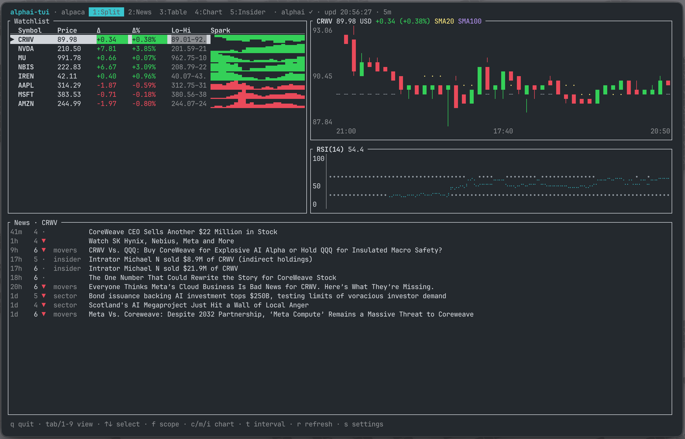

# alphai-tui

Terminal dashboard for watching stocks: live quotes and charts next to
AI-scored financial news, sentiment and SEC Form 4 insider activity.
Built in Rust with [ratatui](https://ratatui.rs).



## What you get

- **Split** (the default view): watchlist and chart side by side in the top
  half, the news feed in the bottom half (hidden on very small terminals).
- **News**: enriched articles for the selected ticker (or the whole market,
  toggle with `f`), each with a 1 to 10 relevance score, category and a
  per-ticker AI sentiment call, plus a 7-day bullish/bearish rollup.
  Enter opens the article page on alphai.io; a settings toggle switches
  that to the original source site.
- **Table**: watchlist with price, change, day range and unicode sparklines.
- **Chart**: candlestick chart of the selected ticker at half-block
  resolution, with a previous-close reference line, SMA 20/100 overlays and
  an RSI(14) panel. `c` switches to the classic Braille line chart, `m` and
  `i` toggle the indicators, `t` cycles interval presets on the fly.
- **Insider**: SEC Form 4 activity for the selected ticker. A 30-day rollup
  (buys vs sells, dollar volumes, share of pre-arranged 10b5-1 plan trades,
  most active insiders) above the stream of filing events.
- In-app settings (`s`): pick the price source, paste API keys once and
  choose where Enter opens news articles.
  Everything is saved to a config file, so after the first run a bare
  `alphai-tui` is enough.

Prices work with no key at all (Yahoo). News, sentiment and insider views
use the [AlphaAI](https://alphai.io) API and need a free key.

## Install

With a Rust toolchain (1.85+):

```sh
cargo install --git https://github.com/makeev/alphai-stock-tui-platform
```

Or from a clone:

```sh
git clone https://github.com/makeev/alphai-stock-tui-platform
cd alphai-stock-tui-platform
cargo run --release -- AAPL MSFT NVDA BTC-USD
```

## Quick start

```sh
alphai-tui AAPL MSFT NVDA BTC-USD
```

The first run opens the settings screen: pick a price source and paste your
AlphaAI key (get one free at [alphai.io](https://alphai.io), Account >
API keys). Leave it empty if you only want quotes and charts. Your watchlist
and options persist in the config file, so next time plain `alphai-tui` works.

```sh
alphai-tui --once AAPL      # print quotes to stdout and exit (for scripts)
alphai-tui -s finnhub NVDA  # explicit source for one run
```

## Options

| Flag | Default | Meaning |
|------|---------|---------|
| `-s, --source` | `yahoo` | Price source: `yahoo`, `finnhub` or `alpaca` |
| `-e, --every` | `15` | Poll interval, seconds |
| `-r, --range` | `1d` | History window: `1d 5d 1mo 3mo 6mo 1y` |
| `-i, --interval` | `5m` | Candle size: `1m 2m 5m 15m 30m 60m 1d` |
| `--once` | | Print quotes to stdout and exit |

`-r` and `-i` set the startup window; the `t` key cycles preset combinations
for the session without persisting them.

CLI arguments win over the config file; the config file wins over built-in
defaults. API keys can also come from env vars, which win over the config:
`ALPHAI_API_KEY`, `FINNHUB_API_KEY`, `APCA_API_KEY_ID`, `APCA_API_SECRET_KEY`.

## Keys

| Key | Where | Action |
|-----|-------|--------|
| `Tab` / `1`..`5` | everywhere | switch view |
| `↑` `↓` / `j` `k` | table, chart, split | select ticker |
| `↑` `↓` / `j` `k` | news, insider | scroll articles |
| `←` `→` / `h` `l` | news, insider | switch ticker |
| `Enter` / `o` | news, insider | open article in browser |
| `f` | news, split | toggle selected ticker / whole market |
| `c` | chart, split | toggle candlestick / line chart |
| `m` | chart, split | toggle SMA 20 and SMA 100 overlays |
| `i` | chart, split | toggle the RSI(14) panel |
| `t` / `T` | everywhere | cycle candle interval presets forward / back (`5m` `15m` `60m` `1d`, each with a matching history window) |
| `r` | everywhere | refresh prices and the visible news view |
| `s` | everywhere | settings |
| `q` / `Esc` / `Ctrl-C` | everywhere | quit |

## Data sources

**Prices**

- `yahoo`: no API key, quote and candle history in one request, roughly
  15 minutes delayed. Crypto and FX tickers work as `BTC-USD`, `EURUSD=X`.
- `finnhub`: needs a key (free at [finnhub.io](https://finnhub.io)).
  Real-time-ish quotes; historical candles are premium-only there, so charts
  build up from quotes collected during the session and reset on restart.
  Range/interval switching with `t` does not apply to that synthetic
  history, and candles degrade to flat marks.
  Free tier is 60 req/min: keep `tickers x (60 / --every)` under 60.
  Crypto needs exchange-prefixed symbols (`BINANCE:BTCUSDT`).
- `alpaca`: needs a key id and secret (free at
  [alpaca.markets](https://alpaca.markets)). Realtime quotes from the IEX
  feed plus real historical bars, so charts are complete right after start
  instead of growing over the session. Crypto works in the usual `BTC-USD`
  form. Getting free keys:
  1. Sign up at [alpaca.markets](https://alpaca.markets). Email is enough;
     market data and paper trading need no KYC.
  2. The free Basic data plan is enabled by default.
  3. In the dashboard switch the environment to Paper (fine for data), then
     Home > API Keys > Generate. Copy the Key ID and the Secret; the secret
     is shown only once.
  4. Paste both in the settings screen (`s`) or export `APCA_API_KEY_ID`
     and `APCA_API_SECRET_KEY`.

  Free plan notes: the IEX feed is realtime but thin (roughly 2 to 3 percent
  of market volume, so charts of illiquid names can be sparse), and the API
  allows 200 requests/min. The app makes 2 requests per ticker per poll:
  keep `tickers x 2 x (60 / --every)` under 200. `ALPACA_FEED=sip` needs a
  paid data plan; `ALPACA_FEED=delayed_sip` gives the full market with a
  15 minute delay.

**News, sentiment, insider**

- [AlphaAI](https://alphai.io): AI-enriched financial news feed. Every
  article carries validated tickers, a category, a deterministic 1 to 10
  relevance score and per-ticker sentiment; insider rows are generated
  from SEC EDGAR Form 4 filings, one row per economic event. The free tier
  (no card) allows 20 requests/min and 100/day. The app is careful with
  that budget: it fetches only what the visible view needs and caches each
  response for 5 minutes. Full API reference:
  [alphai.io/developers](https://alphai.io/developers).

Ticker forms follow the US/Yahoo convention (`AAPL`, `BTC-USD`, `VOD.L`),
which is also what AlphaAI uses. Finnhub-specific symbols like
`BINANCE:BTCUSDT` will not have news attached.

## Config file

`~/.config/alphai-tui/config.toml` on Linux and macOS (`%APPDATA%` on
Windows), created by the settings screen with mode 0600 since it can hold
keys. Saving the settings also persists the watchlist on screen:

```toml
source = "yahoo"
watchlist = ["AAPL", "MSFT", "NVDA", "BTC-USD"]
every = 15
range = "1d"
interval = "5m"
news_open = "alphai"  # where enter opens news: "alphai" or "original"

[keys]
alphai = "ak_live_..."
finnhub = ""
alpaca_key_id = ""
alpaca_secret = ""
```

## Architecture

```
src/
  domain.rs      Quote, Candle, TickerData, Range/Interval
  config.rs      config file load/save (CLI > env > file > defaults)
  source/        DataSource trait + implementations
    yahoo.rs     Yahoo v8 chart endpoint (quote + history in one call)
    finnhub.rs   Finnhub /quote with synthetic session history
    alpaca.rs    snapshot + real historical bars (IEX/SIP feeds, crypto)
  alphai.rs      AlphaAI API client + demand-driven fetch task (TTL cache)
  indicators.rs  SMA and RSI (Wilder smoothing)
  poller.rs      fetches all symbols concurrently on a timer -> mpsc channel
  app.rs         App state + key handling + event loop + settings logic
  ui/            View trait + implementations
    table.rs     watchlist table
    chart.rs     candlestick + line chart, SMA overlays, RSI panel
    split.rs     table + chart
    news.rs      article list + sentiment rollup + detail pane
    insider.rs   Form 4 rollup + filing list
    settings.rs  modal settings overlay
```

Data flows one way: background tasks (price poller, AlphaAI fetcher) push
events over an mpsc channel into `App::apply`; views are stateless renderers
over `&mut App`. The UI never blocks on the network.

### Adding a price source

Implement `source::DataSource` (one async `fetch` returning quote + candles)
in a new module and register it in `source::make_source`.

### Adding a view

Implement `ui::View` (a stateless `render` over `&mut App`) as a unit struct
and add it to `ui::VIEWS`. Order in that array defines the `1`..`9` hotkeys.

## Development

```sh
cargo test          # unit + TestBackend rendering tests
cargo clippy --all-targets
cargo run -- --once AAPL             # network smoke test without a TTY
ALPHAI_API_KEY=ak_live_... cargo test live_api -- --ignored   # live API smoke
```

Issues and PRs are welcome.

## License

MIT. Not investment advice; data comes from third-party sources and can be
delayed or wrong. Respect the terms of the data providers you enable.
